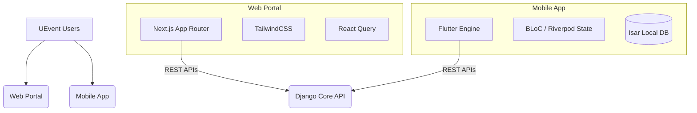

<div align="center">
  

  # UEvent Frontend Repository
  
  **Next-Gen Omnichannel Client Ecosystem**

  [](https://nextjs.org/)
  [](https://reactjs.org/)
  [](https://flutter.dev/)
  [](https://www.typescriptlang.org/)
  [](https://opensource.org/licenses/MIT)
  [](http://makeapullrequest.com)

  *Engineered for **Phân hiệu Trường Đại học Giao thông Vận tải tại Thành phố Hồ Chí Minh (UTC2)***
</div>

---

## 📖 Table of Contents

- [About The Project](#-about-the-project)
- [Repository Architecture](#-repository-architecture)
- [1. Web Admin Portal (Next.js)](#1-web-admin-portal-nextjs)
- [2. Mobile Attendee App (Flutter)](#2-mobile-attendee-app-flutter)
- [Project Structure](#-project-structure)
- [Installation & Getting Started](#-installation--getting-started)
- [Engineering Standards & QA](#-engineering-standards--qa)
- [Contributing](#-contributing)
- [License](#-license)

---

## 🚀 About The Project

The **UEvent Frontend Repository** houses the client-facing applications for the UEvent ecosystem. By separating concerns between the administrative backend portal and the on-the-ground mobile application, this repository ensures the best possible UX/UI for diverse user roles.

It serves two distinct target audiences:
1. **Event Administrators & Organizers**: Utilizing a sprawling, SEO-optimized web dashboard to create complex event forms, manage roles, and review analytics.
2. **Attendees & On-Site Operators**: Relying on a blazing-fast, offline-capable mobile application to receive push notifications, generate entry QR codes, and quickly scan incoming attendees at the physical event gates.

---

## 🏛 Repository Architecture

Rather than maintaining separate Git histories, the UEvent frontend codebase is structured cleanly to house both web and mobile logic.



---

## 🌐 1. Web Admin Portal (Next.js)

The web client is an expansive management interface.

### Key Features
- **Intuitive Form Builder**: Drag-and-drop UI to construct complex event registration fields, generating schemas sent directly to the Backend's JSONB handlers.
- **Deep Analytics Dashboards**: Visual charts tracking ticket sales, check-in rates, and real-time room capacity.
- **User Governance**: Interfaces to assign Co-hosts, Staff, and Check-in Operators dynamically.

### Tech Stack
- **Framework**: Next.js 14+ (App Router) + React 18
- **Language**: TypeScript
- **Styling**: TailwindCSS for utility-first, responsive layouts.
- **Data Fetching**: React Query (TanStack) for caching and optimistic UI updates.

---

## 📱 2. Mobile Attendee App (Flutter)

The mobile client is optimized for speed, reliability under poor network conditions, and rapid execution.

### Key Features
- **Offline-First Resilience**: Uses `Isar` to cache ticket data locally, allowing attendees to view their QR code even inside concrete halls with zero signal.
- **Cryptographic QR Wallet**: Generates a 15-second rotating digital signature. It guarantees that screenshots sent to friends cannot be used for entry.
- **Operator Scanner Module**: Staff members access a highly optimized barcode scanning view capable of parsing and validating hundreds of attendees per minute.

### Tech Stack
- **Framework**: Flutter 3.19+ (Dart)
- **Architecture Standard**: Clean Architecture (Domain, Data, Presentation layers strictly separated).
- **State Management**: BLoC / Cubit for complex business logic, Riverpod for dependency injection.
- **Network**: `Dio` with custom interceptors for JWT token refresh.

---

## 📂 Project Structure

```bash
UEvent-Frontend/
├── web/                      # Next.js Web Directory
│   ├── src/
│   │   ├── app/              # App Router Pages
│   │   ├── components/       # Reusable React components
│   │   ├── lib/              # Axios instances, utilities
│   │   └── styles/           # Global Tailwind directives
│   ├── package.json
│   └── tailwind.config.ts
│
├── mobile/                   # Flutter Mobile Directory
│   ├── lib/
│   │   ├── core/             # Routing, Theme, Errors
│   │   ├── features/         # Feature-first structure (events, tickets)
│   │   │   └── event/
│   │   │       ├── data/     # Models, Repositories, Data Sources
│   │   │       ├── domain/   # Entities, Use Cases
│   │   │       └── present/  # UI, Widgets, BLoCs
│   │   └── main.dart         # Entry point
│   └── pubspec.yaml
│
└── stitch_assets/            # Shared branding assets, icons, fonts
```

---

## 💻 Installation & Getting Started

### 1. Web Application

```bash
cd web

# Install Node dependencies
npm install  # or yarn install

# Setup Environment
cp .env.example .env.local
# Update .env.local with NEXT_PUBLIC_API_URL=http://localhost:8000/api/v1

# Run development server
npm run dev
```

Visit `http://localhost:3000` to access the portal.

### 2. Mobile Application

```bash
cd mobile

# Fetch Flutter packages
flutter pub get

# Generate necessary boilerplate (if using Freezed/Injectable)
flutter pub run build_runner build --delete-conflicting-outputs

# Configure API URL in your local .env or config file
# API_BASE_URL=http://<YOUR_BACKEND_IP>:8000/api/v1

# Run on an emulator or connected physical device
flutter run
```

---

## ⚙️ Engineering Standards & QA

We hold our client applications to strict enterprise standards:
- **Linting Guidelines**: The Next.js project enforces strict `eslint` rules. The Flutter app uses `flutter_lints` and `dart format`.
- **Clean Architecture Enforcement**: In the mobile directory, UI widgets are forbidden from importing data sources or HTTP clients directly; everything must pass through the Domain layer's Use Cases.
- **Component Reusability**: The Web platform relies on a strict internal Design System mapped out in `components/ui/`.

---

## 🤝 Contributing

1. Fork the Repository.
2. Create a Feature Branch (`git checkout -b feature/NewUI`).
3. If working on Flutter, ensure `flutter test` and `flutter analyze` pass.
4. If working on Web, ensure `npm run build` succeeds without linting errors.
5. Commit your Changes (`git commit -m 'Implement NewUI'`).
6. Push to the Branch (`git push origin feature/NewUI`).
7. Open a Pull Request.

---

## 📜 License

Distributed under the MIT License. See `LICENSE` for more information.