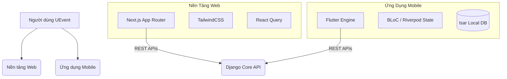

<div align="center">
  

  # UEvent Frontend Repository (Tiếng Việt)
  
  **Hệ Sinh Thái Giao Diện Sự Kiện Đa Nền Tảng Thế Hệ Mới**

  [](https://nextjs.org/)
  [](https://reactjs.org/)
  [](https://flutter.dev/)
  [](https://www.typescriptlang.org/)
  [](https://opensource.org/licenses/MIT)
  [](http://makeapullrequest.com)

  *Được thiết kế độc quyền cho **Phân hiệu Trường Đại học Giao thông Vận tải tại TP.HCM (UTC2)***
</div>

---

## 📖 Mục Lục

- [Giới Thiệu Dự Án](#-giới-thiệu-dự-án)
- [Kiến Trúc Repository](#-kiến-trúc-repository)
- [1. Cổng Thông Tin Web (Next.js)](#1-cổng-thông-tin-web-nextjs)
- [2. Ứng Dụng Mobile (Flutter)](#2-ứng-dụng-mobile-flutter)
- [Cấu Trúc Thư Mục](#-cấu-trúc-thư-mục)
- [Hướng Dẫn Cài Đặt](#-hướng-dẫn-cài-đặt)
- [Tiêu Chuẩn Kỹ Thuật & Đảm Bảo Chất Lượng](#-tiêu-chuẩn-kỹ-thuật--đảm-bảo-chất-lượng)
- [Hướng Dẫn Đóng Góp](#-hướng-dẫn-đóng-góp)
- [Bản Quyền](#-bản-quyền)

---

## 🚀 Giới Thiệu Dự Án

**UEvent Frontend** là repository tập trung mã nguồn của toàn bộ các nền tảng giao diện phía người dùng (Client-facing). Bằng cách tách biệt ứng dụng Web quản trị và ứng dụng Mobile di động, kho lưu trữ này mang đến trải nghiệm UI/UX tốt nhất cho từng đối tượng cụ thể.

Hệ thống phục vụ 2 nhóm người dùng chính:
1. **Ban Quản Trị & Ban Tổ Chức (Web)**: Sử dụng một Dashboard web khổng lồ, chuẩn SEO để xây dựng các biểu mẫu đăng ký, quản lý ban bệ nhân sự và theo dõi báo cáo phân tích.
2. **Sinh Viên Tham Dự & Nhân Viên Quét Vé (Mobile)**: Dựa vào một ứng dụng di động tốc độ siêu cao, có khả năng hoạt động ngay cả khi rớt mạng, để nhận thông báo, xuất mã QR vé và quét mã cho sinh viên ngay tại cổng kiểm soát.

---

## 🏛 Kiến Trúc Repository

Mã nguồn được tổ chức rành mạch, phân tách rõ ràng giữa Web và Mobile trong cùng một không gian thư mục.



---

## 🌐 1. Cổng Thông Tin Web (Next.js)

Giao diện Web là bảng điều khiển mạnh mẽ dành cho cấp quản lý.

### Tính Năng Nổi Bật
- **Trình Tạo Form Trực Quan (Form Builder)**: Giao diện kéo-thả giúp ban tổ chức lắp ghép các trường dữ liệu tùy biến, tự động biên dịch thành schema JSONB để gửi lên Backend.
- **Dashboard Phân Tích Chuyên Sâu**: Biểu đồ trực quan theo dõi lượng vé phát hành, tỷ lệ người check-in thực tế và sức chứa phòng học.
- **Quản Trị Người Dùng**: Giao diện điều phối và gán quyền (Đồng tổ chức, Nhân viên, Ban kiểm duyệt) cực kỳ nhanh chóng.

### Công Nghệ Sử Dụng
- **Khung Ứng Dụng**: Next.js 14+ (App Router) + React 18
- **Ngôn Ngữ**: TypeScript
- **Giao Diện**: TailwindCSS (Responsive layout)
- **Truy Xuất Dữ Liệu**: React Query (TanStack) giúp cache dữ liệu và phản hồi UI ngay lập tức (Optimistic updates).

---

## 📱 2. Ứng Dụng Mobile (Flutter)

Ứng dụng di động được tối ưu hóa về tốc độ, hoạt động ổn định trong các hội trường bê tông kém sóng.

### Tính Năng Nổi Bật
- **Sức Chịu Đựng Mất Mạng (Offline-First)**: Sử dụng CSDL `Isar` siêu tốc lưu trữ vé về máy. Sinh viên có thể mở vé QR kể cả khi điện thoại hoàn toàn mất kết nối 4G/Wifi.
- **Ví QR Mã Hóa Chữ Ký Số**: Tự động sinh mã QR xoay vòng mỗi 15 giây. Hệ thống triệt tiêu hoàn toàn khả năng qua cửa bằng việc gửi ảnh chụp màn hình vé cho bạn bè.
- **Module Máy Quét Cấp Độ Nhàn Rỗi (Operator Scanner)**: Nhân viên cổng sử dụng module quét mã vạch chuyên dụng cực kỳ nhẹ, quét liên tục và xử lý hàng trăm sinh viên một phút không giật lag.

### Công Nghệ Sử Dụng
- **Khung Ứng Dụng**: Flutter 3.19+ (Dart)
- **Kiến Trúc Tiêu Chuẩn**: Clean Architecture (Chia tách nghiêm ngặt 3 lớp: Domain, Data, Presentation).
- **Quản Lý Trạng Thái**: BLoC / Cubit cho logic phức tạp, Riverpod để tiêm phụ thuộc (Dependency Injection).
- **Kết Nối Mạng**: `Dio` với các bộ đánh chặn (interceptors) tự động làm mới JWT Token.

---

## 📂 Cấu Trúc Thư Mục

```bash
UEvent-Frontend/
├── web/                      # Thư mục mã nguồn Next.js Web
│   ├── src/
│   │   ├── app/              # Router App của Next.js
│   │   ├── components/       # Các component UI tái sử dụng
│   │   ├── lib/              # Tiện ích, cấu hình Axios
│   │   └── styles/           # CSS toàn cục & Tailwind config
│   ├── package.json
│   └── tailwind.config.ts
│
├── mobile/                   # Thư mục mã nguồn Flutter Mobile
│   ├── lib/
│   │   ├── core/             # Lỗi, Theme, Điều hướng
│   │   ├── features/         # Cấu trúc chia theo tính năng (Feature-first)
│   │   │   └── event/
│   │   │       ├── data/     # Gọi API, Local DB, Models
│   │   │       ├── domain/   # Luật nghiệp vụ, Use Cases
│   │   │       └── present/  # UI, Widgets, BLoC State
│   │   └── main.dart         # File khởi chạy
│   └── pubspec.yaml
│
└── stitch_assets/            # Hình ảnh, font, thiết kế dùng chung
```

---

## 💻 Hướng Dẫn Cài Đặt & Khởi Chạy

### 1. Nền Tảng Web (Next.js)

```bash
cd web

# Cài đặt thư viện Node
npm install  # hoặc yarn install

# Thiết lập Môi trường
cp .env.example .env.local
# Đổi biến NEXT_PUBLIC_API_URL=http://localhost:8000/api/v1 (trong file .env.local)

# Chạy server ở chế độ Development
npm run dev
```

Truy cập `http://localhost:3000` trên trình duyệt để kiểm tra.

### 2. Ứng Dụng Mobile (Flutter)

```bash
cd mobile

# Tải các gói thư viện Flutter
flutter pub get

# Tạo các file code sinh tự động (Nếu xài Freezed/Injectable)
flutter pub run build_runner build --delete-conflicting-outputs

# Cấu hình URL gọi API trong file .env
# API_BASE_URL=http://<IP_MÁY_CHỦ_BACKEND_CỦA_BẠN>:8000/api/v1

# Khởi chạy trên máy ảo hoặc thiết bị thật cắm cáp
flutter run
```

---

## ⚙️ Tiêu Chuẩn Kỹ Thuật & Đảm Bảo Chất Lượng

Chúng tôi áp dụng các tiêu chuẩn Enterprise nghiêm ngặt cho mã nguồn Frontend:
- **Nguyên Tắc Code Sạch (Linting)**: Code Web phải pass các luật của `eslint`. Code Mobile phải tuân thủ quy tắc `flutter_lints` và `dart format`.
- **Luật Clean Architecture Thép**: Tại thư mục Mobile, nghiêm cấm các UI Widget gọi trực tiếp Data Sources hoặc API. Mọi dữ liệu phải đi qua bộ lọc của Domain layer (Use Cases).
- **Tính Tái Sử Dụng**: Nền tảng Web áp dụng triệt để Design System nội bộ (tham khảo thư mục `components/ui/`).

---

## 🤝 Hướng Dẫn Đóng Góp

1. Fork dự án về tài khoản của bạn.
2. Tạo một Branch chứa tính năng mới (`git checkout -b feature/GiaoDienMoi`).
3. Nếu code Flutter, đảm bảo lệnh `flutter test` và `flutter analyze` không có lỗi.
4. Nếu code Web, đảm bảo lệnh `npm run build` chạy thành công.
5. Commit đoạn code (`git commit -m 'Hoàn thiện GiaoDienMoi'`).
6. Push nhánh lên mạng (`git push origin feature/GiaoDienMoi`).
7. Tạo Pull Request trên GitHub.

---

## 📜 Bản Quyền

Dự án phát hành dưới giấy phép MIT License. Xem file `LICENSE` để hiểu rõ thêm.
